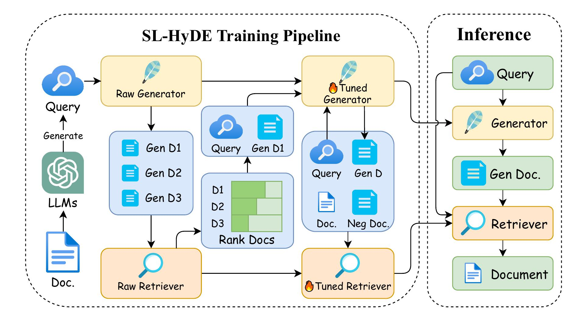
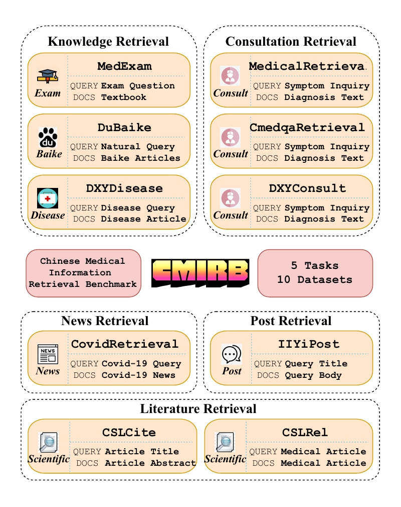

<h1 align="center">AutoMIR: Effective Zero-Shot Medical Information Retrieval without Relevance Labels</h1>

<p align="center">
    <a href="https://arxiv.org/abs/2410.20050">
        
    </a>
    <a href="https://r2med.github.io/">
        
    </a>
    <a href="https://huggingface.co/CMIRB" target="_blank">
        
    </a>
    <a href="https://opensource.org/licenses/MIT">
        
    </a>
</p>

<p align="center">
    Lei Li, 
    Xiangxu Zhang,
    Xiao Zhou, 
    Zheng Liu, 
</p>
<p align="center">Gaoling School of Artificial Intelligence, Renmin University of China</p>
<p align="center">Beijing Academy of Artificial
Intelligence</p>

## 🔭 Overview

### AutoMIR: Effective Zero-Shot Medical Information Retrieval without Relevance Labels

 In this work, we propose Self-Learning Hypothetical Document Embeddings for zero-shot medical information retrieval, eliminating the need for relevance-labeled data. 
 
 We alse develop a comprehensive Chinese Medical Information Retrieval Benchmark and evaluate the performance of various text embedding models on it.

<p align="center">
    <a>
        
    </a>
</p>

## ⚙️  Installation
Note that the code in this repo runs under **Linux** system. We have not tested whether it works under other OS.

1. **Clone this repository:**

    ```bash
    git clone https://github.com/ll0ruc/AutoMIR1.git
    cd automir
    ```

2. **Create and activate the conda environment:**

    ```bash
    conda create -n automir python=3.10
    conda activate automir
    pip install torch==2.4.0 torchvision==0.19.0 torchaudio==2.4.0 --index-url https://download.pytorch.org/whl/cu121
    pip install beir==2.0.0
    pip install mteb==1.1.1
    pip install deepspeed==0.15.1
    pip install peft==0.12.0
    pip install transformers==4.44.2
    pip install sentence-transformers==3.1.1
    pip install datasets==2.21.0
    pip install vllm==0.5.4
    ```

## 💾 Datasets Preparation
### CMIRB Description:
CMIRB (Chinese Medical Information Retrieval Benchmark) is a specialized multi-task dataset designed specifically for medical information retrieval. 

It consists of data collected from various medical online websites, encompassing 5 tasks and 10 datasets, and has practical application scenarios. 

<p align="center">
    <a>
        
    </a>
</p>

## Datasets
The data preprocessing process can be seen in [data_collection_and_processing](./examples/data_collection_and_processing.md).

An overview datasets available in CMIRB is provided in the following table:

| Name |  Hub URL | Description | Query #Samples | Doc #Samples | 
|:-----:|:-----:|:---------------------------:|:-----:|:-----:|
| [MedExamRetrieval](https://arxiv.org/abs/2410.20050) | [CMIRB/MedExamRetrieval](https://huggingface.co/datasets/CMIRB/MedExamRetrieval) | Medical multi-choice exam  | 697 | 27,871 |
| [DuBaikeRetrieval](https://arxiv.org/abs/2410.20050) | [CMIRB/DuBaikeRetrieval](https://huggingface.co/datasets/CMIRB/DuBaikeRetrieval) | Medical search query from BaiDu Search  | 318 | 56,441 |
| [DXYDiseaseRetrieval](https://arxiv.org/abs/2410.20050) | [CMIRB/DXYDiseaseRetrieval](https://huggingface.co/datasets/CMIRB/DXYDiseaseRetrieval) | Disease question from medical website  | 1,255 | 54,021 |
| [MedicalRetrieval](https://arxiv.org/abs/2203.03367) | [CMIRB/MedicalRetrieval](https://huggingface.co/datasets/C-MTEB/MedicalRetrieval) | Passage retrieval dataset collected from Alibaba search engine systems in medical domain | 1,000  | 100,999 |
| [CmedqaRetrieval](https://aclanthology.org/2022.emnlp-main.357.pdf) | [CMIRB/CmedqaRetrieval](https://huggingface.co/datasets/C-MTEB/CmedqaRetrieval) |  Online medical consultation text | 3,999 | 100,001 |
| [DXYConsultRetrieval](https://arxiv.org/abs/2410.20050) | [CMIRB/DXYConsultRetrieval](https://huggingface.co/datasets/CMIRB/DXYConsultRetrieval) | Online medical consultation text  | 943 | 12,577 |
| [CovidRetrieval](https://aclanthology.org/2022.emnlp-main.357.pdf) | [CMIRB/CovidRetrieval](https://huggingface.co/datasets/C-MTEB/CovidRetrieval) | COVID-19 news articles | 949  | 100,001 |
| [IIYiPostRetrieval](https://arxiv.org/abs/2410.20050) | [CMIRB/IIYiPostRetrieval](https://huggingface.co/datasets/CMIRB/IIYiPostRetrieval) | Medical post articles  | 789 | 27,570 |
| [CSLCiteRetrieval](https://arxiv.org/abs/2410.20050) | [CMIRB/CSLCiteRetrieval](https://huggingface.co/datasets/CMIRB/CSLCiteRetrieval) | Medical literature citation prediction  | 573 | 36,703 |
| [CSLRelatedRetrieval](https://arxiv.org/abs/2410.20050) | [CMIRB/CSLRelatedRetrieval](https://huggingface.co/datasets/CMIRB/CSLRelatedRetrieval) | Medical similar literatue  | 439 | 36,758 |


### Download the CMIRB dataset:

- **CMIRB:** [](https://huggingface.co/CMIRB)

    Place all zip files under `./AutoMIR/dataset` and extract them.

### Data Structure:

For each dataset, the data is expected in the following structure:

```
${DATASET_ROOT} # Dataset root directory, e.g., ./dataset/MedExamRetrieval
├── query.jsonl        # Query file
├── corpus.jsonl        # Document file
└── qrels.txt         # Relevant label file
```

## 🤖 Training

Download the medical corpus from [huatuo_encyclopedia_qa](https://huggingface.co/datasets/FreedomIntelligence/huatuo_encyclopedia_qa)

### 1.0 Generate query from corpus
  ```bash
  python gen_Data.gen_Query_data.py --corpus_path "./train_data/corpus.jsonl" --llm_name Qwen-32b
  ```
You will get the query.jsonl file in the train_data folder, which contains the generated queries for each document in the corpus.

### 1.1 Generate training data for LLM
  ```bash
  python gen_Data.gen_LLM_data.py --query_path "./train_data/query.jsonl" --llm_name_gen_llm qwen
  ```
You will get the llm_train_data.jsonl file in the train_data/qwen folder, which contains the generated training data for LLM.

### 1.2 Fine-tuning LLM as Generator
  ```bash
  bash run train_llm.sh
  ```
You will get the fine-tuned LLM model in the outputs/qwen folder, which can be used as a generator for generating retwriten queries.

### 2.1 Generate training data for Retriever
  ```bash
  python gen_Data.gen_EMB_data.py --llm_name qwen
  ```
You will get the emb_train_data.jsonl file in the train_data/qwen folder, which contains the generated training data for retriever.

### 2.2 Fine-tuning Retriever
  ```bash
  bash run train_emb.sh
  ```
You will get the fine-tuned retriever model in the outputs/qwen folder, which can be used for retrieving relevant documents based on the generated queries.


## 💽 Evaluate
We evaluate 10+ representative retrieval models of diverse sizes and architectures. Run the following command to get results:
  ```bash
  cd ./src
  python evaluate.py --retrieval_name bge-FT --llm_name qwen
  * `--retriever_name`: the retrieval model to evaluate.
  * `--llm_name`: the generator to evaluate.
  ```

## 🏆 Leaderboard
### Information Retrieval 
| Model | Dim. | Avg. | MedExam | DuBaike | DXYDisease | Medical | Cmedqa | DXYConsult | Covid | IIYiPost | CSLCite | CSLRel |  
|:-------------------------------|:--------:|:--------:|:--------:|:--------:|:--------:|:--------:|:--------:|:--------:|:--------:|:--------:|:--------:|:--------:|
| [text2vec-large-zh](https://huggingface.co/GanymedeNil/text2vec-large-chinese) | 1024 | **30.56** | 41.39 | 21.13 | 41.52 | 30.93 | 15.53 | 21.92 | 60.48 | 29.47 | 20.21 | 23.01 |
| [mcontriever(masmarco)](https://huggingface.co/facebook/mcontriever-msmarco) | 768 | **35.20** | 51.5  | 22.25 | 44.34 | 38.5  | 22.71 | 20.04 | 56.01 | 28.11 | 34.59 | 33.95 |
| [bm25](https://huggingface.co/BAAI/bge-large-zh-v1.5) | - | **35.35** | 31.95 | 17.89 | 40.12 | 29.33 | 6.83  | 17.78 | 78.9  | 66.95 | 33.74 | 29.97 |
| [text-embedding-ada-002](https://openai.com/index/new-and-improved-embedding-model/) | - | **42.55** | 53.48 | 43.12 | 58.72 | 37.92 | 22.36 | 27.69 | 57.21 | 48.6  | 32.97 | 43.4  |
| [m3e-large](https://huggingface.co/moka-ai/m3e-large) | 768 | **45.25** | 33.29 | 46.48 | 62.57 | 48.66 | 30.73 | 41.05 | 61.33 | 45.03 | 35.79 | 47.54 |
| [multilingual-e5-large](https://huggingface.co/intfloat/multilingual-e5-large) | 1024 | **52.08** | 53.96 | 53.27 | 72.1  | 51.47 | 28.67 | 41.35 | 75.54 | 63.86 | 42.65 | 37.94 |
| [piccolo-large-zh](https://huggingface.co/sensenova/piccolo-large-zh) | 1024 | **54.75** | 43.11 | 45.91 | 70.69 | 59.04 | 41.99 | 47.35 | 85.04 | 65.89 | 44.31 | 44.21 |
| [gte-large-zh](https://huggingface.co/sensenova/piccolo-large-zh) | 1024 | **55.40** | 41.22 | 42.66 | 70.59 | 62.88 | 43.15 | 46.3  | 88.41 | 63.02 | 46.4  | 49.32 |
| [bge-large-zh-v1.5](https://huggingface.co/BAAI/bge-large-zh-v1.5) | 1024 | **55.40** | 58.61 | 44.26 | 71.71 | 59.6  | 42.57 | 47.73 | 73.33 | 67.13 | 43.27 | 45.79 |
| [peg](https://huggingface.co/TownsWu/PEG) | 1024 | **57.46** | 52.78 | 51.68 | 77.38 | 60.96 | 44.42 | 49.3  | 82.56 | 70.38 | 44.74 | 40.38 |
| [HyDE (qwen+bge)](https://github.com/texttron/hyde) | 1024 | **56.62** | 64.39 | 52.73 | 73.98 | 57.27 | 38.52 | 47.11 | 74.32 | 73.07 | 46.16 | 38.68 |
| [SL-HyDE (qwen+bge)](https://github.com/ll0ruc/AutoMIR1) | 1024 | **59.38** | 71.49 | 60.96 | 75.34 | 58.58 | 39.07 | 50.13 | 76.95 | 73.81 | 46.78 | 40.71 |


## 📜Reference

If this code or dataset contributes to your research, please kindly consider citing our paper and give this repo ⭐️ :)
```
@article{li2024automir,
  title={AutoMIR: Effective Zero-Shot Medical Information Retrieval without Relevance Labels},
  author={Li, Lei and Zhang, Xiangxu and Zhou, Xiao and Liu, Zheng},
  journal={arXiv preprint arXiv:2410.20050},
  year={2024}
}
```
